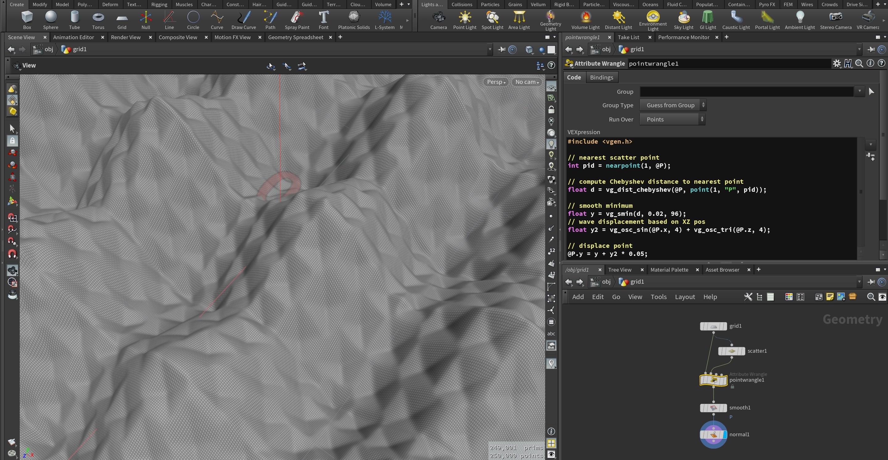

# vexed-generation

A collection of common utilities and functions for maths, geometry
generation & processing in [SideFX Houdini
VEX](https://www.sidefx.com/docs/houdini/vex/) (incl. some OpenCL). Most
of these were created when I started using Houdini in earnest in early
2016, but have proven themselves useful ever since and extend the
built-in VEX arsenal. Some operations (e.g. Marching squares, Parallel
Transport Frames, Disjoint Set etc.) were ported from some of my Clojure
libraries.

## Installation

```bash
git clone https://github.com/thi-ng/vexed-generation.git
```

Add the following variables to your `houdini.env` file (replacing
`<absulute-path-to-vexed-generation>` with the location of where you
cloned this repo on your drive), then start Houdini:

```
HOUDINI_VEX_PATH = <absulute-path-to-vexed-generation>/vex;&;
HOUDINI_OCL_PATH = <absulute-path-to-vexed-generation>/opencl;&;
```

See here for more details about the [`houdini.env` file](https://www.sidefx.com/docs/houdini/basics/config_env.html).

## Usage

Vexed generation functions can be used in any suitable VEX context (SOP,
SHOP etc.). Simply include `vgen.h` into your VEX source code / wrangle
snippet. See [/vex](vex/) for available functions.

All functions, types/structs in this library are prefixed with `vg_`.

### Example



1. Create a new "Grid" and configure it to:
    - ZX plane
    - size 1x1
    - rows / cols 500 x 500
2. Attach a "Scatter" node, set point count to 500, relax iterations to 20
3. Attach a "Point Wrangle" using the "Grid" as first input and "Scatter" as 2nd input:

```c
#include <vgen.h>

// nearest scatter point
int pid = nearpoint(1, @P);

// compute Chebyshev distance to nearest point
float d = vg_dist_chebyshev(@P, point(1, "P", pid));

// smooth minimum
float y = vg_smin(d, 0.02, 96);
// wave displacement based on XZ pos
float y2 = vg_osc_sin(@P.x, 4) + vg_osc_tri(@P.z, 4);

// displace point
@P.y = y + y2 * 0.05;
```

## API

`TYPE` here refers to one of possible types (`float`, `vector2`, `vector`, `vector4` etc).

### Arrays

[Source](vex/vgen_arrays.h)

- `TYPE[] vg_into(TYPE a[]; const TYPE b[])`

### Attributes

[Source](vex/vgen_attribs.h)

- `TYPE[] vg_point_attribs_TYPE(int geo; string attr; const int pts[])`
- `vector[] vg_point_positions(int geo; const int pts[])`
- `vector[] vg_point_positions(int geo, prim)`

### Centroid

[Source](vex/vgen_centroid.h)

- `vector2 vg_centroid(const vector2 pts[])`
- `vector vg_centroid(const vector pts[])`
- `vector vg_centroid(int geo; const int pts[])`
- `vector vg_prim_centroid(int geo, prim)`
- `int[] vg_add_edge_centroids(int geo; const int pts[])`
- `int[] vg_add_edge_centroids_uv(int geo; const int pts[])`

### Disjoint Set

[Source](vex/vgen_disjointset.h)

A Disjoint Set is a data structure for undirected graphs:

```c
vgDisjointSet ds;

// init w/ max ID
ds->init(10);

// connect IDs
ds->union(0, 3);
ds->union(2, 3);

// check if IDs are connected
ds->unified(0, 2);
// 1
```

### Distance

[Source](vex/vgen_distance.h)

- `vector vg_closest_point_line(const vector a; const vector b; const vector p)`
- `vector vg_closest_point_edges(int geo; const int edges[]; const vector p)`
- `float vg_dist_manhattan(TYPE a, b)`
- `float vg_dist_chebyshev(TYPE a, b)`

### 2D Marching Squares

Implementation based on
[thi.ng/ndarray](https://github.com/thi-ng/ndarray/blob/master/src/contours.org)

[Source](vex/vgen_marchingsquares.h)

```c
float data[];
resize(data, cols * rows);
for(int i = npoints(0); --i >= 0;) {
    data[i] = vector(point(0,"P", i)).y;
}

vgMSQ msq;
msq->init(data, cols, rows);
// extract contours for isovalue 0.1
msq->find_contours(0, 0.1, ident());
```

### Maths

[Source](vex/vgen_math.h)

- `float vg_absmin(float a, b)`
- `float vg_absmax(float a, b)`
- `float vg_ceil(float x, prec)`
- `TYPE vg_clamp(TYPE x, a, b)`
- `TYPE vg_fract(TYPE x)`
- `float vg_floor(float x, prec)`
- `TYPE vg_mix(const TYPE a, b, t)`
- `TYPE vg_mix_bilinear(const TYPE a, b, c, d; float u, v)`
- `TYPE vg_mix_bilinear(const TYPE a, b, c, d; const vector2 uv)`
- `TYPE vg_mod(TYPE x, y)`
- `float vg_round(float x, prec)`
- `TYPE vg_sclamp(TYPE x, a, b; float k)`
- `TYPE vg_smin_exp(TYPE a, b; float k)`
- `TYPE vg_smin_poly(TYPE a, b; float k)`
- `TYPE vg_smin_pow(TYPE a, b; float k)`
- `TYPE vg_smin(TYPE a, b; float k)`
- `TYPE vg_smax(TYPE a, b; float k)`
- `TYPE vg_smoothstep(const TYPE e, e2, t)`
- `TYPE vg_smootherstep(const TYPE e, e2, t)`
- `TYPE vg_step(const TYPE e, t)`
- `float vg_signedArea2_xy(vector a,b,c)`
- `float vg_signedArea2_xz(vector a,b,c)`
- `float vg_signedArea2_yz(vector a,b,c)`

### Oscillators

[Source](vex/vgen_osc.h)

- `float vg_osc_cos(float phase, freq, amp, dc)`
- `float vg_osc_saw(float phase, freq, amp, dc)`
- `float vg_osc_sin(float phase, freq, amp, dc)`
- `float vg_osc_square(float phase, freq, amp, dc)`
- `float vg_osc_sin(float phase, freq, amp, dc)`
- `float vg_osc_tri(float phase, freq, amp, dc)`
- `float vg_osc_tri_concave(float phase, freq, amp, dc)`
- `float vg_osc_sinsaw(float phase,freq, amp, dc, t)`
- `float vg_osc_sinsquare(float phase,freq, amp, dc, t)`
- `float vg_osc_sintri(float phase,freq, amp, dc, t)`
- `float vg_osc_sawsquare(float phase,freq, amp, dc, t)`
- `float vg_osc_sawtri(float phase,freq, amp, dc, t)`
- `float vg_osc_squaretri(float phase,freq, amp, dc, t)`
- `float[] vg_sample_ramp(string op_path; int n)`
- `float vg_osc_wavetable(float table[]; float phase, freq, amp, dc)`
- `float vg_osc_by_id(string id; float phase, freq, amp, dc)`

### Parallel Transport Frames

Implementation based on [thi.ng/geom](https://github.com/thi-ng/geom/blob/develop/src/types/ptf.org)

[Source code](vex/vgen_ptf.h)

### Tessellators

[Source](vex/vgen_tessel.h)

- `int[] vg_tessellate_first(int geo; const int pts[])`
- `int[] vg_tessellate_first(int geo, prim)`
- `int[] vg_tessellate_trifan(int geo; const int pts[])`
- `int[] vg_tessellate_trifan(int geo, prim)`
- `int[] vg_tessellate_quadfan(int geo; const int pts[])`
- `int[] vg_tessellate_quadfan(int geo, prim)`
- `int[] vg_tessellate_quadfan_uv(int geo; const int pts[])`
- `int[] vg_tessellate_quadfan_uv(int geo, prim)`
- `int[] vg_tessellate_mid(int geo; const int pts[])`
- `int[] vg_tessellate_mid(int geo, prim)`
- `int vg_add_triangle(int geo, a, b, c)`
- `int[] vg_quad_strip(int geo; const int row1[]; const int row2[]; int num, closed)`

## License

This project is licensed under the Apache Software License 2.0

&copy; 2016 Karsten Schmidt